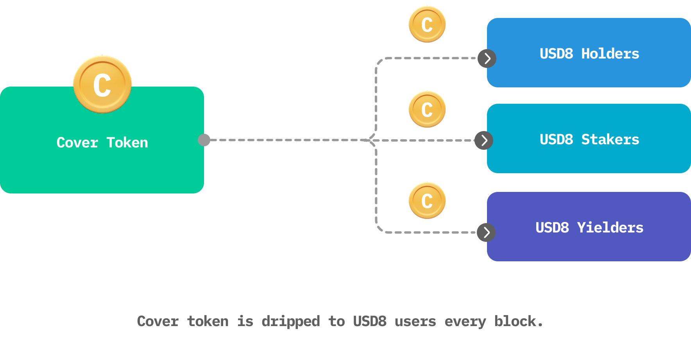
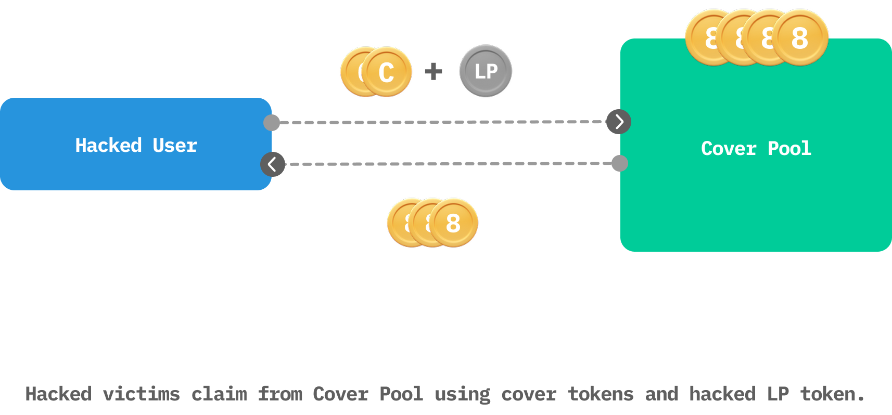

# 🥷 Hack Coverage

This super power provides hack coverage through Cover Token, a non-transferable token that allows holders to claim reimbursement—up to a limit—if any of their positions are hacked in a covered DeFi protocol (not limited to USD8 positions). The more Cover Tokens a user holds, the greater their potential reimbursement. Reimbursements are paid from a Cover Pool financed by USD8.

The only way to obtain Cover Tokens is by using USD8 — whether holding, staking, or yielding. Cover Tokens are automatically accrued to USD8 users every block.

- Accrual rates may differ for holding, staking, or yielding.
- Users can claim reimbursement from the Cover Pool by burning Cover Tokens.
- Cover Tokens never expire.

 
 
 

 
 
 

# 👌🏽 Coverage Limits

Cover Tokens provide coverage for up to a maximum of 90% of a user's loss. The actual percentage is calculated per claim and depends on the following factors:

- The user's loss and Cover Token balance
- The aggregated loss and Cover Token balance from all claimants for the hack
- The per-protocol coverage tier
- The current Cover Pool size

This means a small Cover Token balance might still receive high coverage if there are few claimants, while a large balance might not guarantee high coverage if many others are also claiming with large balances.

In general, the larger a user's Cover Token balance, the greater the payout. This process is on-chain, with all information publicly available.

 
 
 

# 👛 Cover Pool

The Cover Pool is financed exclusively by USD8’s own earnings; user deposits remain untouched in a segregated Reserve Pool. The Cover Pool may start small, but as USD8’s user base and fee revenue grow, so does the size of the Cover Pool. This means the pool might not be able to cover 100% of hack losses, especially in the early days of USD8. However, we believe partial coverage is better than none, and we aim to grow the pool significantly as USD8 expands.

If a major payout drains the pool, USD8 will divert a portion of future profits to refill it on a monthly schedule until the target balance is restored.

 
 
 

# 🤞 Covered DeFi Protocols

Cover Token extends permissionless hack coverage to selected DeFi protocols up to a limit. Our in-house security team performs independent audits and continuous reviews to ensure each covered protocol meets rigorous safety standards.

Each protocol is assigned a tier that caps the share of the Cover Pool available for any single incident:

- Platinum – up to 100% of the Cover Pool
- Gold – up to 80% of the Cover Pool
- Silver – up to 40% of the Cover Pool
- Bronze – up to 10% of the Cover Pool

Defi protocols:

| Protocol | Type | Condition |
|:---|:---|:---|
| USD8 | Platinum | `1 USD8 redeems < $0.7`  |
| Aave  |Under Review  | Under Review |
| Curve |Under Review  | Under Review |
| Ethena |Under Review  | Under Review |
| Uniswap |Under Review  | Under Review |
| Sky |Under Review  | Under Review |
| Lido |Under Review  | Under Review |
| Rocket Pool |Under Review  | Under Review |
| Compound |Under Review  | Under Review |
| Morpho |Under Review  | Under Review |
| Pendle|Under Review  | Under Review |
| Balancer |Under Review  | Under Review |
| More.. |  |  |

The USD8 team verifies, assigns, and—when necessary—updates these covers on an ongoing basis. Coverage announcements, upgrades, downgrades, or removals are published transparently, and we encourage users to use only protocols that carry an active USD8 cover tier.

 
 
 

# 💵 Claims

Claims can be initiated permissionlessly at any time against the Cover Pool if claim conditions are met.

Once initiated, other users will have a two-week window to join the claim. After that, claims can be finalized.

- The protocol computes each claimant’s payout based on the total claim amount and Cover Token balance
- Claimants transfer the compromised LP/position tokens and burn the required Cover Tokens.m
- Reimbursement is paid in USD8, calculated at the current oracle price.
- The LP token is removed from Covered Protocols after a claim
 
 
 

 
 
 

For math lovers, the system uses the following formula to calculate actual reimburse amount for each user:   

$$actualAmt = max(\frac{coverPoolSize * protocolCoverLimit * userLpAmt}{\displaystyle\sum_{i=1}^n(1 + \frac{userCoverToken_i * f}{userLp_i}) * userLp_i}, 0.9 * lpValueBeforeHack)$$

- `protocolCoverLimit` is the factor associated with the cover type for this protocol
- `n` is the total number of claims
- `f` is a constant set by protocol to determines the weight of Cover Token in proportion to LP token in a claim
- `lpValueBeforeHack` is the LP value before the hack

