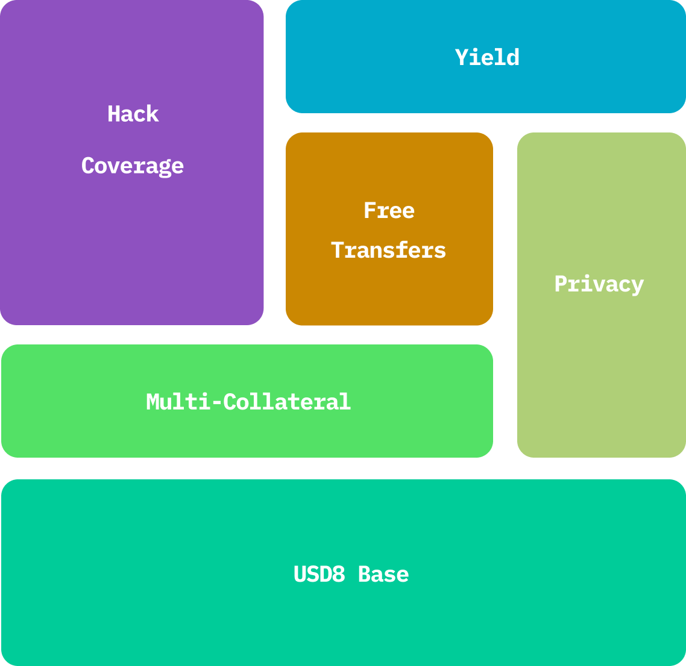

  

# What is USD8

USD8 is a stablecoin wrapper with extra superpowers. Anyone can wrap or unwrap USD8 to and from the underlying stablecoin. By using USD8, users gain additional benefits on top of the underlying asset, while still retaining its core properties such as yield and a stable peg.

At launch, USD8 will accept USDC as the underlying stablecoin. Other stablecoins may be added in the future.

 
 
 

 
# Superpowers

USD8’s superpowers are modular and often passive features, each providing users with unique benefits. By stacking these features, USD8 becomes a powerful stable asset with unlimited potential.

Below is a list of USD8’s superpowers currently in development. Some will be available at launch, while others will be added over time:

- Hack Coverage
- Yield
- Multi-Collateral
- Free Transfers
- Privacy
- And many more…
 
 
 
 

 
 
 
# Why should I use USD8?

USD8 offers more benefits than traditional stablecoins while maintaining core properties such as a stable peg and yield. As USD8 grows, we plan to add even more exciting superpowers for its users, making it the first truly extendable stable asset.