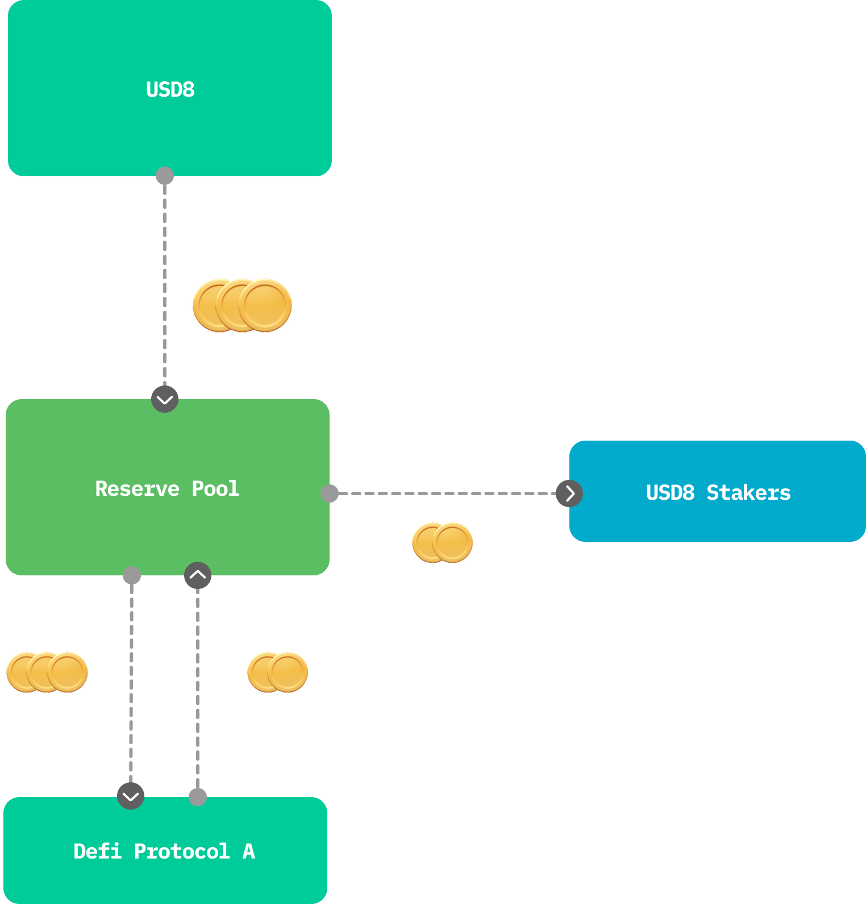

# Yield
    

This superpower provides underlying yield to USD8 users. By staking USD8, users get competitive yield while still keeping other benefits on top, such as the Cover Token for hack coverage. The USD8 treasury is deployed into blue-chip DeFi protocols, and the generated yield is distributed back to USD8 stakers through this superpower. 
 
 

 
 
 